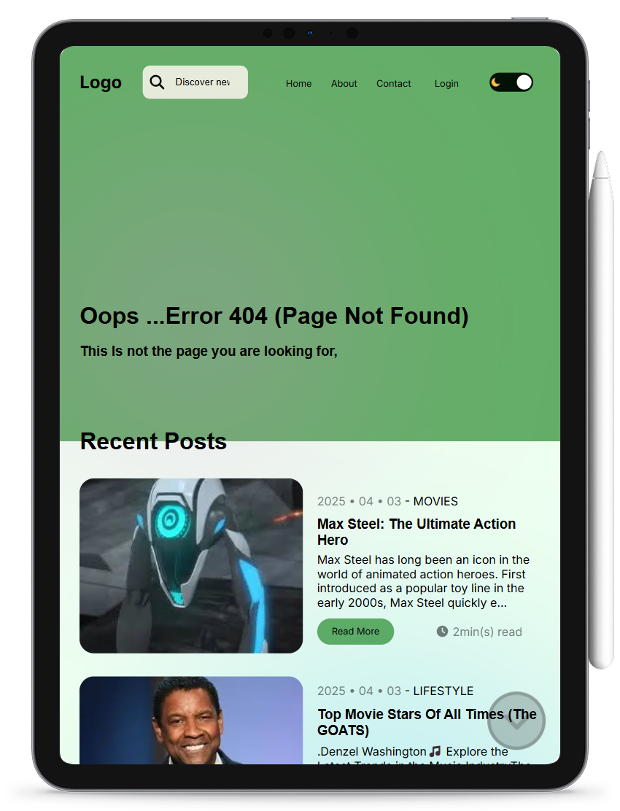

# GitHub README Site Preview

**Automatically generate responsive device mockups of your website and display them in your GitHub README using screenshots.**

<!-- PLACEHOLDER: Add a demo banner or screenshot here -->


## Table of Contents

- [Overview](#overview)
- [Features](#features)
- [Installation](#installation)
- [Configuration](#configuration)
- [Usage](#usage)
- [Sample Output Files](#sample-output-files)
- [Contributing](#contributing)

## Overview

The GitHub README Site Preview tool is designed to help you generate dynamic, device-specific screenshots of any website, process them into attractive mockups and output these images for use on your Website README. The tool supports multiple device types (laptop, tablet, mobile), theme toggling (if selectors are provided), and flexible command-line inputs. It can also be integrated into GitHub Actions for automated, scheduled updates.

## Features

- **Screenshot Capture**: Capture screenshots from a specified URL with customizable viewport dimensions.
- **Multiple Device Support**: Generate previews for different devices (laptop, tablet, mobile) using predefined configurations.
- **Theme Toggling**: (Optional) If a CSS selector or XPath is provided for a theme toggle, the tool captures two screenshots (e.g., light and dark themes).
- **Mockup Embedding**: Processes and embeds the captured screenshots into device mockups with rounded corners using Sharp.
- **Flexible CLI**: Accept parameters via command-line arguments (URL, devices, output, selectors) using `yargs`.
- **GitHub Actions Integration**: Easily integrate into GitHub Actions for scheduled or on-demand updates.
- **Error Handling**: Gracefully handles invalid URLs and provides clear logging on skipped devices.

## Installation

Clone the repository and install the dependencies:

```bash
git clone https://github.com/Programming-Sai/Github-README-Site-Preview.git

cd Github-README-Site-Preview

npm install
```

## Configuration

The project is organized into several parts:

```bash

./Github-README-Site-Preview/*
        ├─ assets/*
        |       ├─ Laptop.png
        |       ├─ Mobile.png
        |       └─ Tablet.png
        ├─ public/*
        |       └─ ... # Ouputs Are Saved Here By Default
        ├─ src/*
        |       ├─ config/*
        |       |       └─ deviceConfigs.js
        |       ├─ utils/*
        |       |       ├─ embed.js
        |       |       ├─ screenshot_capture.js
        |       |       └─ themeToggle.js
        |       └─ index.js
        ├─ .fttignore
        ├─ .gitignore
        ├─ m.md
        ├─ package-lock.json
        ├─ package.json
        └─ README.md

```

- **Core Logic**: Contains the core screenshot and embedding functionality located in the `src/` directory.

  - `src/utils/screenshot_capture.js` – Uses Puppeteer to capture screenshots.
  - `src/utils/embed.js` – Uses Sharp to embed the screenshot buffers into device mockups.
  - `src/config/deviceConfigs.js` – Contains the configuration for each device type (laptop, tablet, mobile).

- **Command-Line Interface**:  
  The main entry point is `src/index.js`, which accepts arguments for URL, devices, output path, and selectors. It uses `yargs` (with positional and named options) to allow flexible configuration.

## Usage

### Running Locally

You can run the tool directly from the command line with either named flags or positional arguments.

#### **Using Named Flags**

```bash
npm run capture -- --url "https://example.com" --devices "laptop,tablet" --output "public/preview.png" --selectors ".btn-toggle-selector1,.btn-toggle-selector2"
```

#### **Using Positional Arguments**

```bash
node src/index.js "https://example.com" "laptop,tablet" "public/preview.png" ".btn-toggle-selector1,.btn-toggle-selector2"
```

### Command-Line Options

- `--url` or `-u`: **(Required)** The URL of the website to capture.
- `--devices` or `-d`: Comma-separated list of device names. Valid values: `laptop`, `tablet`, `mobile`.  
  _Default_: `laptop,tablet,mobile`
- `--output` or `-o`: Path to save the temporary screenshot (this is used internally; final images are output in the `public/` folder).  
  _Default_: `public/preview.png`
- `--selectors` or `-s`: Comma-separated list of CSS selectors to target specific elements for theme toggling (optional).  
  _Default_: (empty)

### Sample Output Files

After running the script, you can expect the output images to be saved in the `public/` folder with names like:

- `public/output_laptop_theme1.png`
- `public/output_laptop_theme2.png`
- `public/output_tablet_theme1.png`
- `public/output_tablet_theme2.png`
- `public/output_mobile_theme1.png`
- `public/output_mobile_theme2.png`

<!-- PLACEHOLDER: Add images of the final outputs for each device here -->
<p align='center'>
<br>
<br>

| Theme 1                                              | Theme 2                                              |
| ---------------------------------------------------- | ---------------------------------------------------- |
|  |  |
|  |  |
|  |  |

<br>
<br>
</p>

<!-- ## GitHub Actions Integration

You can integrate this tool into GitHub Actions to automatically generate and update previews. Below is an example workflow file (`.github/workflows/screenshot-capture.yml`):

```yaml
name: Screenshot Capture

on:
  workflow_dispatch:
    inputs:
      url:
        description: 'The URL to capture'
        required: true
        default: 'https://example.com'
      devices:
        description: 'Comma-separated list of devices (e.g., laptop,tablet,mobile)'
        required: true
        default: 'laptop,tablet,mobile'
      output:
        description: 'Path to save the screenshot'
        required: false
        default: 'public/preview.png'
      selectors:
        description: 'Comma-separated list of CSS selectors'
        required: false
        default: ''
jobs:
  generate:
    runs-on: ubuntu-latest
    timeout-minutes: 10

    steps:
      - name: Checkout Repository
        uses: actions/checkout@v3

      - name: Setup Node.js
        uses: actions/setup-node@v3
        with:
          node-version: '16'

      - name: Install Dependencies
        run: npm install

      - name: Run Screenshot Capture Logic
        run: |
          node src/index.js --url "${{ github.event.inputs.url }}" --devices "${{ github.event.inputs.devices }}" --output "${{ github.event.inputs.output }}" --selectors "${{ github.event.inputs.selectors }}"
```

In this workflow:
- The user can trigger the workflow manually using `workflow_dispatch` inputs.
- The specified URL, devices, output path, and selectors are passed to the tool.
- The tool generates the screenshots and mockup images in the `public/` folder.
- You can later use another step (or a separate workflow) to publish these images (for example, using [peaceiris/actions-gh-pages](https://github.com/peaceiris/actions-gh-pages)). -->

## Contributing

Contributions, feature requests, and bug reports are welcome. Please open an issue or submit a pull request.

<!-- ## License

This project is licensed under the MIT License. See the [LICENSE](LICENSE) file for details. -->

---
